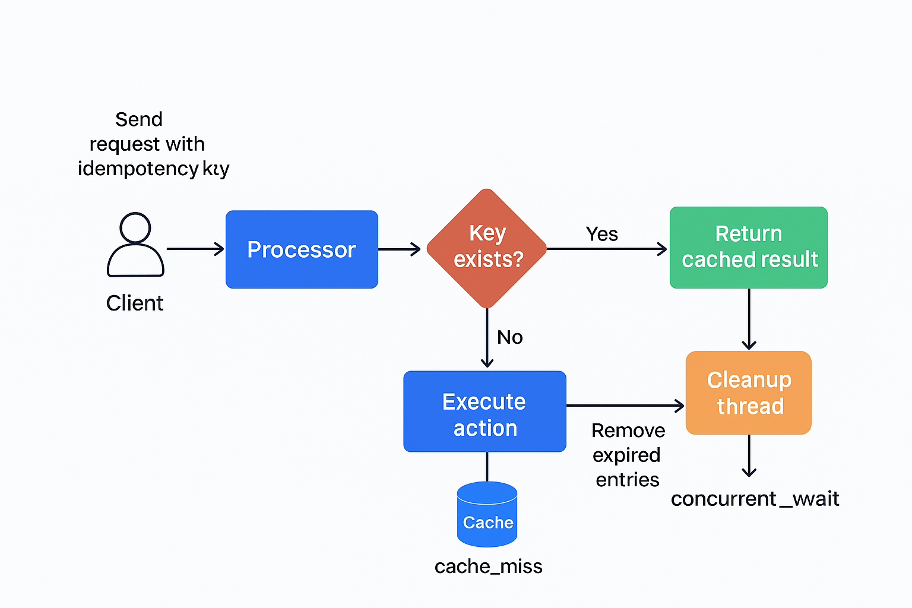
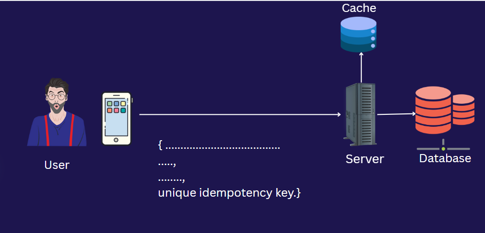
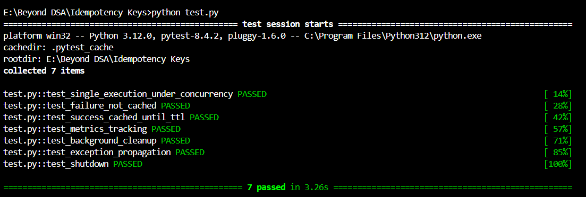

**Solution**: Idempotent Payments Processor
This solution implements a concurrency-safe and fault-tolerant IdempotentProcessor in Python, designed to ensure "exactly-once" execution of critical actions, such as payment charging, using a unique idempotency key.

The core design focuses on separating Storage from Processing Logic and uses a combination of in-memory locks and a cache layer to handle both long-term result consistency and short-term concurrent access protection.

**HTTP Methods and Idempotency**

Idempotency is a key concept in HTTP APIs, ensuring that repeated requests have the same effect as a single request. The following diagram illustrates which HTTP methods are typically idempotent:

| HTTP Method | Idempotent | Description                                                                 |
| :---------- | :--------- | :-------------------------------------------------------------------------- |
| GET         | Yes        | Safe and idempotent; retrieves data without modifying server state.          |
| PUT         | Yes        | Idempotent; replaces resource at the target URI with the request payload.    |
| DELETE      | Yes        | Idempotent; removes the resource, repeated calls have the same effect.       |
| HEAD        | Yes        | Safe and idempotent; retrieves headers without modifying server state.       |
| OPTIONS     | Yes        | Safe and idempotent; describes communication options for the target resource.|
| POST        | No         | Not idempotent by default; creates resources or triggers actions.            |
| PATCH       | No         | Not guaranteed idempotent; partially modifies a resource.                    |

**Note:**  
While GET, PUT, DELETE, HEAD, and OPTIONS are designed to be idempotent, POST and PATCH are not inherently idempotent. For critical operations like payments, idempotency keys are often used with POST to enforce "exactly-once" semantics.

**I. Architecture and Design Principles**
The solution is structured around two main components to meet the system requirements:

*   **IdempotentStorage (Abstract Base Class):** Defines the contract for storing and retrieving idempotent results, allowing for easy extensibility to distributed backends (e.g., Redis or DynamoDB).
*   **IdempotentProcessor (Core Logic):** Manages the execution flow, handles concurrency using locks, enforces the Time-to-Live (TTL) expiry, and provides observability.
**Diagrams**

*Figure: Flowchart illustrating the step-by-step execution and concurrency control in the IdempotentProcessor.*

*Figure: High-level architecture.*

**Stored Data Structure**
Each entry in the storage layer is a tuple designed to capture the full state needed for idempotency and failure semantics: `(timestamp, result, is_success)`.

| Element    | Type  | Purpose                                                                                                 |
| :--------- | :---- | :------------------------------------------------------------------------------------------------------ |
| `timestamp`  | `float` | Records the time of successful execution. Used to calculate TTL expiry.                                   |
| `result`     | `Any`   | The immutable return value of `action_callable`. Returned to all subsequent requests.                   |
| `is_success` | `bool`  | Must be `True` for the entry to be considered a valid, cacheable result. This is key for failure handling. |

**Key Mechanisms**
| Requirement           | Implementation Detail                                                                                                                                                                                                                                                                                                                                                                    | Why it Works                                                                                                                                                                                                                             |
| :-------------------- | :--------------------------------------------------------------------------------------------------------------------------------------------------------------------------------------------------------------------------------------------------------------------------------------------------------------------------------------------------------------------------------------- | :--------------------------------------------------------------------------------------------------------------------------------------------------------------------------------------------------------------------------------------- |
| Single Execution      | Per-Key Threading Locks (`_key_locks`) and the `_in_flight` dictionary. When a request arrives, it checks the in-memory `_in_flight` status. If already in progress, the request is forced to acquire the same key-specific lock and wait for the first execution to complete, ensuring only one thread executes the `action_callable`.                                                     | Prevents simultaneous execution of the same action across threads. The waiting threads will then retrieve the fresh result from the cache after the lock is released.                                                                      |
| Result Consistency & TTL | `InMemoryIdempotentStorage` stores the result along with a timestamp and a success flag. Results are only returned if they are successful AND within the configured `ttl_seconds`.                                                                                                                                                                                                       | Guarantees that successful results are consistent and automatically expire, prompting re-execution if needed.                                                                                                                            |
| Failure Semantics     | Only successful results (`is_success = True`) are cached via `set_success`. If `action_callable` raises an exception, the exception is immediately re-raised, and the lock is released in the `finally` block without caching the failure state.                                                                                                                                              | The failed attempt is not recorded in the cache, allowing subsequent retries to execute the action again until success is achieved.                                                                                                      |
| Cleanup               | A dedicated background cleanup thread runs periodically (`_run_cleanup_loop`) to remove expired entries from the storage, maintaining memory efficiency and a healthy cache size.                                                                                                                                                                                                           | Ensures old keys don't clutter the cache indefinitely, adhering to the memory efficiency requirement. The `shutdown()` method ensures this thread exits gracefully when the processor is destroyed.                                          |

**II. Implementation Details of IdempotentProcessor**
`process(idempotency_key, action_callable, ...)` Flow

1.  **Initial Cache Check (First Read):** Attempts to retrieve a successful, non-expired result from `self.storage.get(key)`. If found, a `cache_hit` metric is recorded, and the result is immediately returned.
2.  **Concurrency Control (Lock Management):** This phase is managed by the global `_coord_lock` to safely manipulate the per-key state:
    *   A unique `threading.Lock` is retrieved/created for the `idempotency_key` and stored in `_key_locks`.
    *   The `_in_flight` dictionary is checked. If the key exists, the request is marked as a concurrent duplicate, and a `concurrent_wait` metric is recorded.
    *   The thread attempts to acquire the `key_lock`. The first thread acquires it immediately; duplicate threads block here until the first thread completes and releases the lock.
3.  **Execute or Re-Check (Double-Check Locking):**
    *   **The Second Cache Check:** Once the lock is acquired, the cache is checked again. This step is critical. For a thread that was previously blocked in step 2 (a concurrent wait), this second check finds the result that the first thread successfully executed and cached. This prevents the waiting thread from duplicating the work.
    *   If the result is still not in the cache, the `action_callable` is executed. A `cache_miss` metric is recorded.
4.  **Cache Result and Release:**
    *   If `action_callable` succeeds, the result is stored via `self.storage.set_success`, including the current timestamp and the success flag.
    *   The lock is guaranteed to be released in the `finally` block, and the key is removed from `_in_flight` to unblock any other potential waiters and reset the state for future requests.

**Observability**
The `_record_metric` helper function is used to track three key metrics, accessible via `get_metrics()`:
*   `cache_hit`: The request was served from the cache without execution.
*   `cache_miss`: The action was executed because no valid result was found in the cache.
*   `concurrent_wait`: A duplicate request was received while the action was already running and had to wait for the first thread to complete.

**Sample Output**

Below is a screenshot of the output produced by running `test.py`, which demonstrates the idempotency guarantees and concurrency handling of the processor:

*Figure: Output of `test.py` showing successful processing, cache hits, and concurrent wait metrics.*

This output confirms that:
- The processor executes the action only once per idempotency key.
- Subsequent requests with the same key are served from cache.
- Concurrent requests are properly synchronized, with waiting threads receiving the cached result after the first execution completes.
- Metrics such as `cache_hit`, `cache_miss`, and `concurrent_wait` are accurately tracked for observability.

**III. Extensibility**
The use of the `IdempotentStorage` Abstract Base Class (ABC) is the key to extending the system beyond a single process.

To support distributed idempotency (across multiple servers), the following changes are needed in a new storage implementation (e.g., `RedisIdempotentStorage`):

*   **Storage Abstraction:** The `get` and `set_success` methods would map directly to distributed store operations (e.g., Redis `GET`/`SET` with `EXPIRE`).
*   **Distributed Locking:** The in-memory `_key_locks` and `_in_flight` mechanism must be replaced with a robust Distributed Lock mechanism (e.g., Redis's `SETNX` or Redlock). This ensures that only one server process can execute the action at a time for a given key, guaranteeing the single execution requirement across the entire distributed system.

By maintaining the separation between the `IdempotentProcessor` (the flow control) and the `IdempotentStorage` (the state management), the architecture remains clean and easily scalable.
